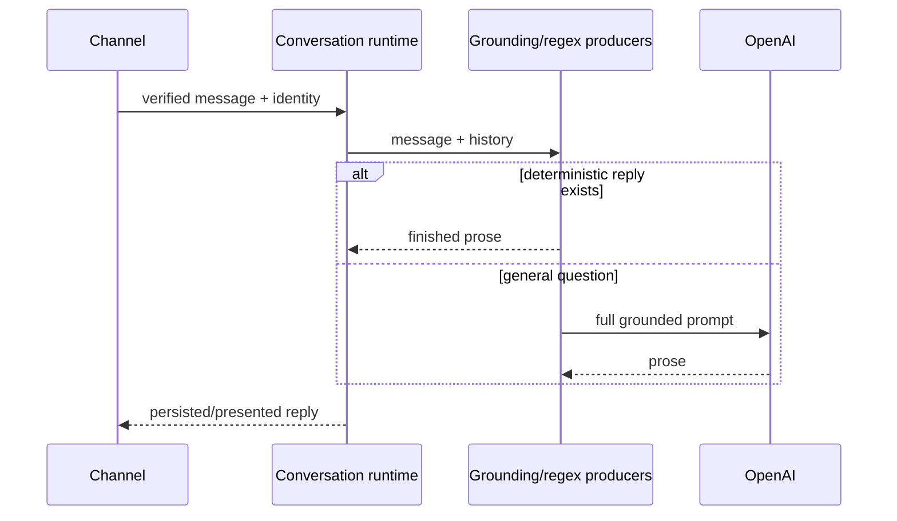
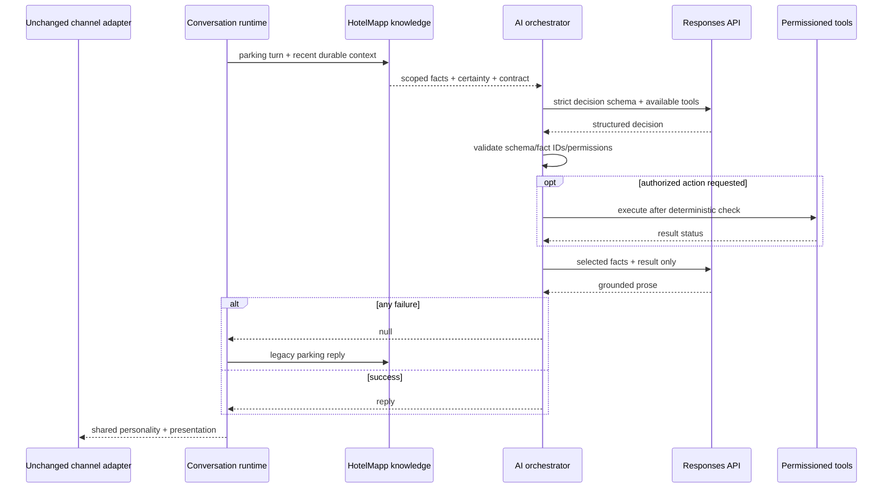

# AI-first hospitality architecture：audit 與 Phase 1

## 1. Current architecture audit

本次以目前分支（合併後的 production baseline）重新盤點，沒有依賴未合併的 composer 實驗。現況 response path 分類如下：

| 類別 | 現有責任與主要位置 | Phase 1 處置 |
| --- | --- | --- |
| A protocol/security | LINE/Meta webhook 驗簽、HTTP method、Meta dedupe/identity、conversation ID | 保留，AI 不可繞過 |
| B factual grounding | `data/hotel-info.js`、`knowledge.js`、`knowledge-grounding.js` | 保留唯一真相；parking 只傳本輪 fact subset 與 certainty |
| C deterministic business rule | booking dates/URL、敏感情境、夜間規則、conversation persistence | 保留 |
| D finished prose producer | `guest-response.js` 的 parking/breakfast/booking/sensitive replies 與 personality renderer | parking 在 flag 開啟時改由 AI；其餘與 parking fallback 保留 |
| E model-generated | `responsesPayload()` 經 Responses API 產生一般回答 | parking 改為「決策 → 驗證 → constrained composition」兩階段 |
| F handoff/tool action | handoff decision、durable confirmation、email transport | 保留 authorization/idempotency；只向模型揭露已獲准 tool |
| G channel transport | Web、LINE、Messenger/Meta、Voice adapter | 不改 transport，不放入 intent、FAQ 或完成文案 |

既有 conversation runtime 會讀 durable turns/topic/intent，生成一次回答後再以 compare-and-set 寫回；Redis 失效時 FAQ 可 stateless fallback，但需要 durable authorization 的 action fail closed。此安全邊界不變。

## 2. AI-first target architecture

```text
Channel transport
  -> verified identity + durable conversation context
  -> HotelMapp fact selection (value + certainty + source/version)
  -> deterministic tool permission projection
  -> immutable core hospitality personality
  -> Responses API structured service decision
  -> schema/fact-ID/tool-permission validation
  -> authorized tool execution (when requested)
  -> constrained prose using selected facts + successful tool results only
  -> shared personality enforcement + channel presentation
  -> transport
```

HotelMapp owns truth, permissions, execution, security and persistence. The model owns semantic understanding, contextual intent, information prioritization, clarification/next-step judgment and natural hospitality wording.

## 3. Phase 1 migration scope

* Add one channel-neutral orchestrator and an explicit `AI_FIRST_ORCHESTRATOR_ENABLED=true` opt-in.
* Migrate parking only. Recent history and durable topic/intent are still supplied through the shared conversation runtime, including the five-turn omitted-subject sequence.
* Make two Responses API requests: strict structured decision, followed by grounded prose composition.
* Keep every legacy path. A disabled flag or any decision/API/schema/composition error returns `null` to the existing parking producer.
* Do not change hotel facts or Web/LINE/Messenger/Voice transports. Instagram and future text adapters should call the same shared answer surface.

Phase 2 should shadow decisions without guest impact, expand fact selectors for check-in/breakfast/luggage/room/transport, and compare groundedness/latency. Phase 3 can add permissioned service tools and migrate the remaining finished prose producers topic by topic. Phase 4 removes a legacy producer only after its rollback window and parity gates pass.

The repository currently has no runtime dependencies and already centralizes the official Responses API wire contract, timeout, diagnostics and API-key handling in `response-service.js`. Phase 1 therefore reuses that transport rather than adding an SDK solely for the same endpoint. Re-evaluate the official OpenAI SDK when streaming, built-in tool loops or SDK retry/telemetry provide a concrete benefit; keep the orchestrator interface transport-injectable so that change does not affect channels or grounding.

## 4. Deterministic logic retained

Webhook signatures, authentication, dedupe, rate limiting, identity mapping, privacy minimization, authorization, factual-source validation, payment constraints, confirmation for transactional/destructive actions, persistence/CAS, protocol responses, booking URL/date computation, tool execution and handoff delivery remain code-owned. The model receives an availability projection; it never decides whether permission checks run.

## 5. Logic delegated to model reasoning

For flagged parking turns the model resolves intent and omitted subjects, summarizes the immediate need, selects the smallest useful confirmed facts, decides whether clarification is useful, proposes a next step, and composes natural language. Regex grounding remains as a production-compatible selector/contract and fallback; it is not an authorization mechanism.

## 6. Structured decision schema

`MODEL_DECISION_SCHEMA` is strict (`additionalProperties: false`) and includes:

```json
{
  "intent": "parking_availability | parking_fee | parking_location | parking_process | parking_reservation | parking_problem",
  "user_need": "short semantic summary",
  "facts_to_use": ["IDs from the supplied grounded subset only"],
  "action": "none | contact_front_desk",
  "clarification_needed": false,
  "next_step": null,
  "response_strategy": "answer | clarify | unknown | tool_then_answer"
}
```

Responses API `text.format.type=json_schema` produces the decision. Runtime validation independently rejects extra fields, invalid enum values, overlong values, unknown fact IDs, unavailable tools and inconsistent unknown/tool strategies. Composition receives only selected fact objects—not the whole knowledge document—plus the verified decision and execution result.

## 7. Tool permission model

Tools are deny-by-default. `none` is always available. `contact_front_desk` is exposed only when a trusted identity exists **and** durable server-side authorization state is `confirmed`. Consent mentioned in prose/history is insufficient. Execution results distinguish `completed`, `not_executed` and failure; composition is instructed never to claim completion without `completed`. Payment, cancellation, booking mutation and destructive tools are not exposed in Phase 1.

## 8. Failure and fallback strategy

Missing API key, timeout (existing 25-second abort), connection/HTTP/JSON errors, empty response, schema violation, unknown fact selection, permission denial, execution failure or empty composition all fail closed to the existing parking response. No side effect is retried by the orchestrator. Phase 1 performs no automatic application retry; infrastructure may retry only idempotent decision/composition requests after a measured rollout. Conversation generation is not repeated after an uncertain persistence write.

## 9. Observability

Safe structured events are `orchestration_started`, `grounding_completed`, `model_decision_completed`, `tool_requested`, `tool_completed`, `response_composed`, `ai_fallback_used`, and `orchestration_failed`. Fields are bounded metadata such as channel, topic, intent, strategy, counts, status, versions and latency. Logs exclude message/history, response prose, identity, PSID, tokens, API keys and secrets; arbitrary exception messages are reduced to a safe code.

## 10. Modified files

* `ai-core/ai-orchestrator.js`: orchestration, schema, fact boundary, permissions, logs and fallback.
* `ai-core/guest-response.js`: parking feature-flag branch before the unchanged legacy producer.
* `ai-core/index.js`: shared exports.
* `test/ai-first-orchestrator.test.js`: invariants, validation, grounding, permissions, unsupported facts, five turns, fallback, channel parity and category audit coverage.
* This document: audit, architecture and rollout record.

## 11. Before/after sequence diagrams

### Before



### Phase 1 parking with fallback



## 12. Production rollout plan

1. Deploy with flag absent/false; run unit/integration suite and verify no channel delta.
2. Enable in non-production and replay sanitized parking transcripts. Gate on 100% fact-ID validation, zero unsupported facts/actions, fallback rate, p95 latency and cost.
3. Shadow a small production sample without serving AI prose; compare decision to legacy intent and redact all sampled data.
4. Canary 1% of eligible parking turns, then 5%, 25%, 50%, 100%, with an immediate environment-flag rollback at every step.
5. Hold each stage across peak/off-hours. Alert on grounding violations, permission denials, elevated fallback/error rates and latency budget.
6. Keep legacy parking producer through at least one stable release; do not merge rollout with new transactional tools.

## 13. Estimated latency and cost

Phase 1 adds two serial model calls for enabled parking turns. Expected model latency is approximately 1–4 seconds per call under normal conditions (roughly 2–8 seconds total), bounded by the existing 25-second timeout per request. Exact latency must be measured by region/model. Decision output is capped at 500 tokens and prose at 350; scoped parking facts/history limit input. Cost is two request input/output charges instead of one or zero for the legacy path. With typical short history, budget approximately 1–4K input tokens plus at most 850 output tokens per turn; calculate actual spend from the selected model's current pricing and production token telemetry before rollout.

## 14. Environment variables

* **New:** `AI_FIRST_ORCHESTRATOR_ENABLED` (default false; only literal case-insensitive `true` enables).
* **Optional new:** `OPENAI_ORCHESTRATOR_MODEL` to separate orchestration from the existing `OPENAI_MODEL` default.
* **Optional new:** `OPENAI_ORCHESTRATOR_REASONING_EFFORT`; omitted by default because it is only valid for applicable models.
* **Existing:** `OPENAI_API_KEY` remains required for enabled AI calls and is never hardcoded/logged.

No new secret is required. Operational deployment should continue using the existing secret manager.
