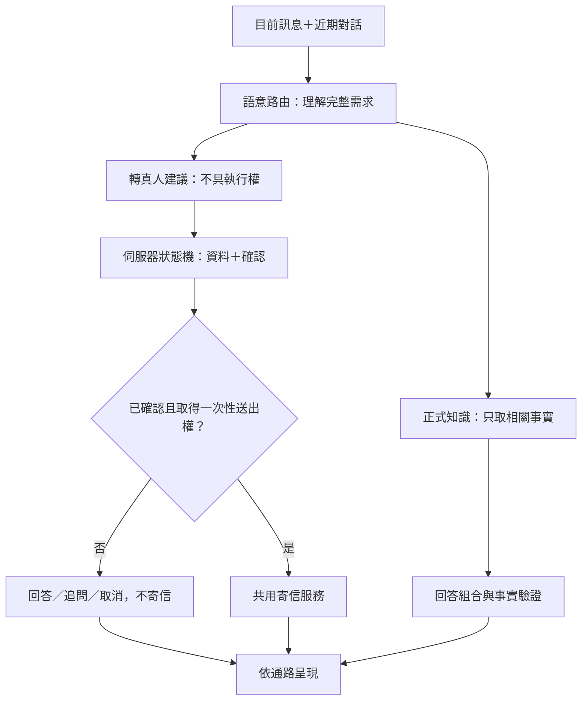

# HotelMapp AI 智慧櫃台完整邏輯

本文件是目前 AI 智慧櫃台的正式設計契約。舊文件若與本文件衝突，以本文件與自動化測試為準。

## 設計目標

- 先理解客人整句話的主詞、目的、時間、否定、條件與承接關係，不以單一關鍵字決定答案。
- 飯店事實只來自 `data/hotel-info.js`；客人或 AI 先前說過的內容只能用來理解指涉，不能變成飯店事實。
- 模型可以建議「這句話需要真人協助」，但不能決定寄信、不能跳過資料收集，也不能宣稱已完成飯店操作。
- Web、LINE、Messenger 與 Voice 共用同一個語意判斷、狀態機、事實來源與寄信服務。
- 不保證模型永遠零誤判；透過驗證、降級與伺服器端權限界線，確保誤判不會變成錯誤事實、未授權寄信或重複寄信。

## 單一處理管線

## 各層責任

| 層級 | 可以做 | 不可以做 |
| --- | --- | --- |
| 語意路由 | 判斷本句 topic、intent、是否請真人處理；用近期對話補足省略指涉 | 回答客人、提供飯店事實、寄信 |
| 正式知識 | 依 topic/intent 提供已確認欄位與未知邊界 | 從常識、歷史對話或模型猜測 |
| 轉接狀態機 | 收姓名與電話/Email、顯示遮蔽後確認內容、處理確認與取消 | 只憑「需要」「好的」或聯絡資料寄信 |
| 執行層 | 驗證持久確認狀態、取得一次性送出權、呼叫寄信服務 | 接受模型文字當授權、重複送同一筆需求 |
| 呈現層 | 依 Web、LINE、Messenger、Voice 調整長度與口吻 | 改寫事實、權限或寄送結果 |

## 語意判斷規則

1. 目前完整句子永遠優先於舊 topic。例如前面談停車，客人現在問「可否直接跟櫃檯訂呢？」必須判為訂房。
2. 只有真正省略主詞的短承接句才引用近期對話，例如停車後的「那第二台呢？」。
3. 「折抵」本身不等於停車。國旅補助的折抵屬補助；車牌或停車費脈絡才屬停車。
4. 否定與條件必須保留。例如「我只是問退款規定，不要聯絡櫃檯」是資訊詢問，不是寄送退款爭議。
5. 詢問櫃檯電話、位置、時間是資訊需求；要求櫃檯回電、接洽、處理或轉告才是轉真人需求。
6. 模型輸出必須符合嚴格 JSON schema。輸出缺欄位、topic/intent 不合法或與目前明確主題衝突時，整個語意結果作廢並使用安全 fallback。
7. 停車位置分成「飯店門口位置」與「配合停車場位置」。客人問「配合／特約停車場在哪裡」時，必須回覆正式知識內的停車場名稱與導航地址，不得重播門口車位數。
8. 客人提供入住日期時，系統要以官方訂房入口為基底產生本輪專用連結，加入 `checkInDate` 與 `checkOutDate`；正式知識內的原始網址不可被修改。模型、固定回答與複合問題都只能使用這個已帶日期的連結。

## 對話口吻契約

- 親切不是固定句首。不能只加「了解／好的／可以的」後接資料句；回答要自然承接客人本輪真正問的細節。
- 追問只補新資訊。例如前一輪已說明門口 3 個車位，下一輪問特約停車場位置時，只回答名稱、地址與必要折抵步驟。
- 一般 LINE 對話以一至三個短句為主；先給答案，再給一個有用的下一步。不要每則都反問或重複「還有什麼可以幫您」。
- 親切不得改變事實、限制、未知狀態或執行結果。

## 轉真人狀態契約

| 目前狀態 | 客人輸入 | 下一狀態 | 可寄信 |
| --- | --- | --- | --- |
| `none` | 明確請真人處理 | `collecting_required_fields` | 否 |
| `collecting_required_fields` | 姓名＋電話或 Email 尚不完整 | 原狀態 | 否 |
| `collecting_required_fields` | 必要資料完整 | `ready_for_confirmation` | 否 |
| `ready_for_confirmation` | 「確認送出」「好的」等確認 | `confirmed` | 尚未；先取得一次性送出權 |
| 任一待確認狀態 | 取消 | `none` | 否 |
| `confirmed` | 一次性權限取得、寄送成功 | `sent` | 已寄一次 |
| `confirmed` | 寄送明確失敗 | `failed` | 否 |
| `confirmed` | 同一送出權已使用但結果無法安全重建 | `delivery_uncertain` | 不重寄 |

每一筆轉接自建立起都有隨機 `requestId`。Redis 的 `SET NX PX` 以「對話 ID＋requestId」取得 48 小時一次性送出權；並行確認、網路逾時或寫入重試都不能讓同一筆寄出第二封。相同 requestId 的狀態只能向前，`sent` 不會被較晚的 `failed` 或 `delivery_uncertain` 覆蓋。新的轉接需求會建立新的 requestId。

## 失敗與降級

- 語意模型失敗：使用整句規則 fallback；飯店事實仍只取正式知識。
- Redis 無法讀取：一般 FAQ 可無狀態回答；所有依賴確認或冪等性的動作拒絕執行。
- 無法取得一次性送出權：不寄信，明確告知尚未安全執行。
- 寄信服務明確失敗：說明未成功，提供櫃檯電話；不得說已通知。
- 寄信後對話寫入不確定：不再次產生答案或重寄；相同 requestId 的後續請求被冪等防線擋下。
- Voice 工具：只能把客人本句原文交給同一套持久狀態機，不能用模型摘要直接呼叫寄信。

## 歷史缺失回歸範圍

`test/ai-front-desk-regression-matrix.test.js` 與相關整合測試永久涵蓋：

- 補助折抵誤判成停車。
- 新訂房問題被舊停車 topic 覆蓋。
- 「接洽櫃檯」「聯絡櫃檯」等自然說法未進入轉接。
- AI 提議轉真人後，客人回覆「好的／需要喔」無法延續。
- 日期、姓名、電話同句輸入後狀態被訂房回答打斷。
- 尚未確認就寄信，或成功前先說已通知。
- 新 FAQ 被過期的資料收集狀態卡住。
- Voice 模型文字繞過資料收集與最後確認。
- 兩次同時確認造成重複信件或已寄狀態倒退。
- 配合停車場地址追問被誤答成門口 3 個車位。
- 指定入住日期的訂房連結仍開在今天。
- 只替資料句加「了解／好的」而沒有自然承接，或追問時重播上一輪答案。

## 變更規則

新增問題類型時，先擴充正式知識與 schema，再補回歸案例；不得直接在通路 adapter 加飯店答案或寄信條件。任何會產生外部副作用的功能，都必須沿用「模型建議、伺服器授權、一次性執行、結果驗證」四道界線。
